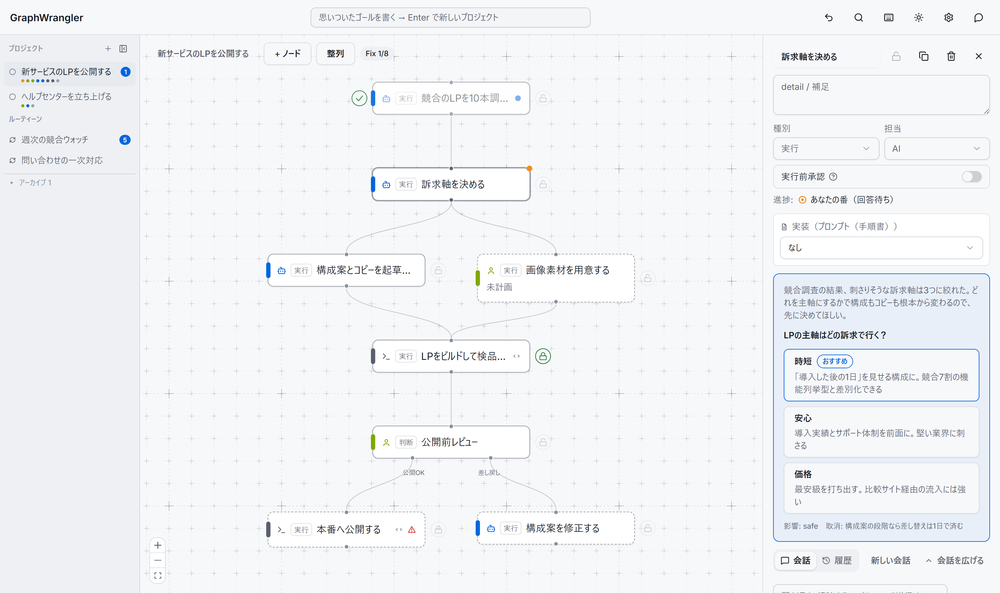
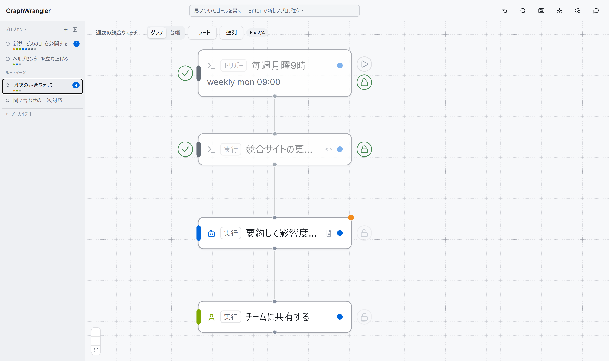
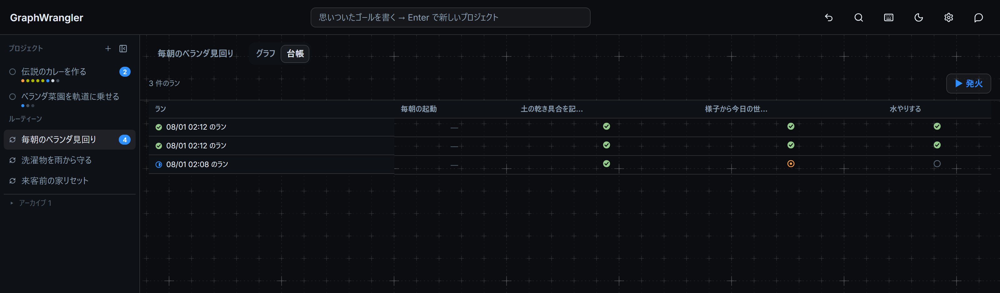

# GraphWrangler

人間・AI・スクリプトが、同じタスクグラフの上で働くツール。

やりたいことをステップのつながり＝グラフに描いて、ステップごとに担当を割り当てる。
人間か、AIか、スクリプトか。AIは整理も実行も受け持ち、人間は要所の判断だけ返す。



画面は3列。左がプロジェクト一覧、中央がグラフ、右が選んだノードの詳細と会話。
プロジェクト名の下に並ぶ色つきの点は「いま誰の番か」。

上のスクリーンショットは「新サービスのLPを公開する」の途中経過。競合LPの調査は
AIが実行済みで、結果はノードの会話に残っている。いまAIは「訴求軸を決める」で
止まり、人間に判断リクエストを出したところ。背景、質問、選ぶとどうなるかまで
書いた選択肢が3つ。この先には人間のレビュー分岐（公開OK / 差し戻し）と、
実行前承認付きのデプロイスクリプトが控える。

調査も起草もAIが進めた。人間がやるのは、選択肢をひとつ押すことだけ。

## 使い方の流れ

ワークフローは最初から完成形では書けない。AIに下書きさせて、直しながら固めていく。

1. **ゴールを投げる。** ヘッダーの入力欄に一行書いて Enter。それだけで新しい
   プロジェクトができる
2. **GraphWrangler AI にざっくり組ませる。** チャットに「こういうことをしたい」と書くと、
   ステップ分解の下書きがグラフに起票される
3. **手で直す。** ノードを足す、消す、並べ替える。担当もここで割り当てる
4. **プランを練って、試す。** ノードの会話でAIと相談しながらやり方を詰め、
   「プラン済みにする」で実行に出す。スクリプトには試走がある。常に `--dry-run`
   付きで走るから、何が起きるかを本番前に確かめられる
5. **Fix で確定する。** うまく回ったノードはロック。以降、やり方の変更はサーバが拒否する
6. **トリガーを置いて定期タスク化。** ランが生まれるたびにAIとスクリプトが回り、
   人間の番のときだけ通知が来る

一度きりのプロジェクトが、そのまま定期業務に育つ。プロジェクトとルーティーンの
違いは、先頭にトリガーがあるかどうかだけ。

## 特徴

### 担当をノード単位で混ぜる

ノード左端の色が担当。黄が人間、青がAI、グレーがスクリプト。「調査と起草はAI、
レビューは人間、ビルドと公開はスクリプト」という分担が1枚のグラフに同居する。

型はこう。最初はAIに裁量でやらせる。やり方が固まったら手順書に落とす。
毎回同じになったらスクリプトへ。AIより速くて、確実で、無料。

公開・送信・削除のような取り返しのつかない操作には「実行前承認」を立てておく。
実行の直前、必ず人間の承認が挟まる。

### 判断も分岐もグラフの上

AIから人間への質問は、判断リクエストのカードで届く。背景、質問、選ぶとどうなるかを
書いた選択肢。選べば即決着、自由文で返せばそのまま会話が続く。

条件分岐は分岐ノードで描く。「公開前レビュー → OKなら公開、ダメなら差し戻し」。
判断者は人間でもAIでもスクリプトでもよく、選ばれなかった枝は自動でスキップされる。

会話はノードに帰属する。相談も実行ログも判断の履歴も、1本のスレッドに時系列で載る。
「この件どうなってたっけ」の答えは、ノードを開けば全部そこにある。

### 繰り返しは「トリガー + ラン」



これは「週次の競合ウォッチ」。毎週月曜9時にランが生まれて、収集（スクリプト）と
要約・影響度判定（AI）まで自動で進む。人間の番（橙色）が来るのは、影響が大きいときだけ。

トリガーの起動方式も3択。

| 起動方式 | 動き | 例 |
|---|---|---|
| スクリプト | 定刻にランを作る（`weekly mon 09:00`、`every 3h` など） | 週次の競合ウォッチ |
| AI | 一定間隔で「今やるべきか」をAIが判断してランを作る | 未対応の問い合わせが溜まったら一次対応を起動 |
| 人間 | ▶ボタンで手動でランを作る | 依頼が来たら見積もりフローを回す |

トリガーが起動するたびにランが生まれる。生まれた瞬間、その時点のグラフ・ノードの中身・会話・実行履歴を
まるごと写し取った専用ページに移る。あとから開き直しても、ランを作った時点の状態がそのまま
再現される。ノード同士が受け渡す値（対象名など）はランに乗って流れ、下流のノードが読む。
実行の途中経過はステップの内訳まで展開でき、未読の通知もラン単位で分かれて届く。
通知のリンクからは、そのランへ直接飛ぶ。

台帳では、テンプレートに紐づく全ランをラン×ステップの表で横断して見渡せる。



### AIは役割ごとに3人

| 呼び名 | 仕事 |
|---|---|
| GraphWrangler AI | 右のチャットドロワー。ページ全体を見てグラフを整理する。ステップ分解の下書き、手順書やスクリプトの起草 |
| Task AI | 各ノードの会話欄。そのノードについての相談相手 |
| 実行AI | 実行エンジンの中。担当=AI のノードを実際に実行し、結果をスレッドに書く |

接続は、ログイン済みの claude CLI をそのまま使うのが既定。APIキーは要らない。
Anthropic / OpenAI のAPIキーに切り替えるなら右上の⚙から。

3人とも、ファイルの読み書き・コマンド実行（Bash）・Web検索までひととおりできる。
取り返しのつかない操作の歯止めは、ツールを取り上げることではなく、実行前承認・試走・
判断リクエストの側にある。MCPツール等をさらに足すなら⚙の「追加許可ツール」へ。

ノードエディタの基本操作もひととおりある。複数選択、コピーと複製、Ctrl+Z、
Ctrl+K の全ノード検索、自動整列、右クリックのコンテキストメニュー。

## セットアップ

必要なのは Node.js 20+ と pnpm。AI機能には、ログイン済みの
[claude CLI](https://claude.com/claude-code)（または Anthropic / OpenAI のAPIキー）。

```bash
pnpm install
pnpm --filter ui build

# サーバ + UI（http://localhost:8770）
pnpm --filter @graphwrangler/server start

# 実行エンジン（AI/スクリプトのステップを自動で進める。別ターミナルで）
pnpm --filter @graphwrangler/engine start
```

データの保存先は既定で `./data`（環境変数 `GRAPHWRANGLER_DATA` で変更、ポートは
`GRAPHWRANGLER_PORT`）。サイト名とファビコンは⚙の「外観（インスタンス全体）」で
インスタンスごとに変えられる（既定は `GraphWrangler` + 同梱アイコン。画像は
データディレクトリに置かれるので、自動アップデートを跨いでも残る）。
まず触ってみるならデモデータを。このREADMEのスクリーンショットと同じ状態になる。

```bash
node scripts/seed-demo.mjs
```

テストは `pnpm test`、型チェックは `pnpm typecheck`（テストは型を見ないので別に回す）。
MCP のツールをサーバ込みで通す e2e は `pnpm e2e`。いずれも push と PR で
GitHub Actions が走る。

## 複数人で使う（ログイン）

一人で使うぶんにはアカウント不要。`node scripts/gw-user.mjs <users.json> add <email>` で
ユーザーを登録した瞬間から、外部経由のアクセスはログイン必須になる（localhost 直は対象外）。
登録が2人以上になると、担当者の割り当て・既読・「あなたの番」が人ごとに分かれる。
以降の追加・無効化・パスワードリセットは、admin ユーザーなら UI からできる。
`users.json`（パスワードハッシュ）は自動で git 管理外に置かれる。

## 既存リポジトリを開く（ワークスペースモード）

リポジトリのルートに `workflow.gw.json` を1つ置いて、それを正データとして開くモード。
会話ログは隣の `.graphwrangler/threads/` に入り、どちらも git にコミットして経緯ごと
版管理する。ラン履歴・undo記録・APIキー入りのAI設定は、自動生成の .gitignore で外れる。

```bash
# 環境変数 か --workspace で正データファイルを指定（ディレクトリ指定なら workflow.gw.json）
GRAPHWRANGLER_WORKSPACE=/path/to/repo/workflow.gw.json pnpm --filter @graphwrangler/server start

# 既存の data ディレクトリからの移行
node scripts/migrate-to-workspace.mjs ./data /path/to/repo/workflow.gw.json
```

ノードの実装は `{type:"doc", path:"docs/x.md"}` の形でリポジトリ内のドキュメントを
参照できる。読むのは実行AI、読むタイミングは実行時。スクリプトの作業ディレクトリも
リポジトリのルート。ファイルの書き出しは決定的（キー順・id順が安定）なので、
git diff が「ノードを1個足した」と読める。

## Claude Code から使う（MCP）

```bash
claude mcp add graphwrangler -- npx tsx <このリポジトリ>/packages/mcp/src/index.ts
```

MCP クライアントから、グラフの読み書き・スレッド投稿・ラン操作ができる。
UI・チャット・MCP のどこから変更しても、通るのは同じ操作ログ。誰がいつ何を
変えたか、常に追える。

## 構成

```
packages/core    … データモデル・グラフストア（操作ログ）・スレッド・ランストア
packages/server  … HTTP API（Hono）+ 内蔵チャット + 試走 + UI配信
packages/engine  … 実行エンジン（script / claude CLI、ラン実行、トリガーのラン作成）
packages/mcp     … MCP サーバ（stdio）
apps/ui          … Web UI（React + React Flow + shadcn/ui）
```

## 設計文書

ここまでに書いたことは、すべて動く。設計の全体は [docs/design.md](docs/design.md) に。
