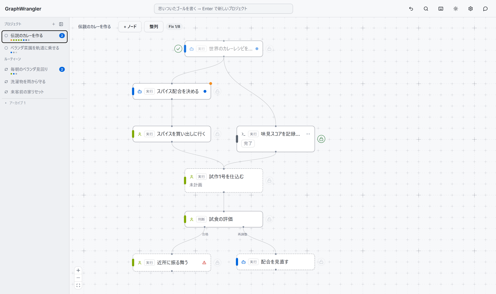

# GraphWrangler

**人間・AI・スクリプトが、同じタスクグラフの上で一緒に働くツール。**

やりたいこと（ゴール）をステップのつながり＝グラフとして整理し、ステップごとに
「人間がやる / AIがやる / スクリプトがやる」を割り当てる。AIは整理も実行も手伝い、
人間は要所の判断だけを返す。


画面は3列。**左**がプロジェクト一覧（タイトル下の色つきの点で、各ステップがいま誰の番かが
一目で分かる）、**中央**がタスクのグラフ、**右**が選んだノードの詳細と会話。
上のスクリーンショットでは、AIが「スパイス配合を決める」を進める途中で人間に
**判断リクエスト**を出している——背景の説明、質問、そして「選ぶとどうなるか」付きの
選択肢。ボタンを1回押せば AI は先へ進む。

## 特徴

### 担当をノード単位で混ぜられる

ノードの左端の色が担当を表す。**黄=人間、青=AI、グレー=スクリプト**。
「調査はAI、買い出しは人間、記録はスクリプト」のような分担が1つのグラフに同居する。

運用の型はこう:

1. 最初はAIに裁量でやらせる
2. 上手くいったやり方を**手順書**（ノードに添付するドキュメント）に固める
3. 毎回同じになった部分は**スクリプト**に置き換える（AIより速く・確実・無料）
4. やり方が確定したら **Fix（ロック）** — 以降、タイトルや手順などの「やり方」は
   サーバが変更を拒否する。進捗の更新は通る

スクリプトには**試走**がある: 実行前に `--dry-run` 付きで1回走らせて、何が起きるかを
確認してから本番に乗せる。取り返しのつかない操作をするノードには**実行前承認**を
立てておくと、実行の直前で必ず人間の承認が挟まる。

### 判断も分岐もグラフの上にある

- **判断リクエスト**: AIから人間への質問は、必ず「背景 + 質問 + 選択肢（選ぶとどうなるか）」
  のカードで届く。選択肢を選べば即決着、自由文で返せばそのまま会話でラリーできる
- **分岐ノード**: 「試食の評価 → 合格なら振る舞う / ダメなら配合を見直す」のような
  条件分岐をノードとして置ける。判断者は人間でもAIでもスクリプトでもよい。
  選ばれなかった枝は自動でスキップされる
- **会話はノードに帰属**: 各ノードが自分のスレッド（相談・実行ログ・判断の履歴）を持つ。
  「この件どうなってたっけ」はノードを開けば全部そこにある

### 繰り返しの仕事は「トリガー + ラン」

フローの先頭に**トリガー**を置くと、そのページはルーティーン（繰り返しのフロー）になる。


トリガーの起動方式も 人間 / AI / スクリプト の3択:

| 起動方式 | 動き | 例 |
|---|---|---|
| スクリプト | 定刻に発火（`daily 07:30`、`every 3h` など） | 毎朝の見回り |
| AI | 一定間隔で「今やるべきか」をAIが判断して発火 | 雨が降りそうなら洗濯物の取り込みを起動 |
| 人間 | ▶ボタンで手動発火 | 来客が決まったら家リセット |

発火のたびに**ラン**（実行1回分の記録）が生まれ、**台帳**でラン×ステップの表として見える:


### AIは役割ごとに3人いる

| 呼び名 | 仕事 |
|---|---|
| **Workflow AI** | 右のチャットドロワー。ページ全体を見てグラフを整理する（ノードの追加・分解・手順書やスクリプトの起草） |
| **Task AI** | 各ノードの会話欄。そのノードについての相談相手 |
| **実行AI** | 実行エンジンの中。担当=AI のノードを実際に実行し、結果をスレッドに書く |

接続方式は、ログイン済みの **claude CLI をそのまま使う**（既定・APIキー不要）か、
Anthropic / OpenAI の APIキーか、UIの⚙設定で選べる。

### そのほか

- ノードエディタとしての基本操作一式: 複数選択・コピー/複製・Ctrl+Z の取り消し・
  Ctrl+K の全ノード検索・自動整列
- ライト / ダークテーマ:



## 使い方の流れ

1. **ヘッダー中央の入力欄に思いついたゴールを書いて Enter** → 新しいプロジェクトが
   できてそのページに移動する
2. Workflow AI とチャットしてステップに分解する（もちろん自分でノードを置いてもいい）
3. 各ステップの担当（人間/AI/スクリプト）を選び、**「プラン済みにする」**で実行に出す
4. エンジンが AI / スクリプトのステップを順に進める。人間の番になるとノードが橙色に
   光り、判断リクエストが届く
5. 定例化したくなったら先頭にトリガーを置く → ルーティーンとして回り始める

## セットアップ

必要なもの: Node.js 20+ / pnpm。AI機能を使うにはログイン済みの
[claude CLI](https://claude.com/claude-code)（または Anthropic / OpenAI の APIキー）。

```bash
pnpm install
pnpm --filter ui build

# サーバ + UI（http://localhost:8770）
pnpm --filter @graphwrangler/server start

# 実行エンジン（AI/スクリプトのステップを自動で進める。別ターミナルで）
pnpm --filter @graphwrangler/engine start
```

データは既定で `./data` に保存される（環境変数 `GRAPHWRANGLER_DATA` で変更、
ポートは `GRAPHWRANGLER_PORT`）。試しに触るならデモデータを入れると
このREADMEのスクリーンショットと同じ状態になる:

```bash
node scripts/seed-demo.mjs
```

テストは `pnpm test`（全パッケージ）。

## 既存リポジトリを開く（ワークスペースモード）

プロジェクトのリポジトリに、ワークフロー定義ファイルを1つ置いて開くこともできる。
グラフ定義は `workflow.gw.json`、会話ログは隣の `.graphwrangler/threads/` に入り、
どちらも git にコミットして経緯ごと版管理する（ラン履歴・undo記録・APIキーを含む
AI設定は自動生成の .gitignore で除外される）。

```bash
# 環境変数 か --workspace で正データファイルを指定（ディレクトリ指定なら workflow.gw.json）
GRAPHWRANGLER_WORKSPACE=/path/to/repo/workflow.gw.json pnpm --filter @graphwrangler/server start

# 既存の data ディレクトリからの移行
node scripts/migrate-to-workspace.mjs ./data /path/to/repo/workflow.gw.json
```

ノードの実装は `{type:"doc", path:"docs/x.md"}` のようにリポジトリ内のドキュメントを
パスで参照でき、実行AIが実行時に読む。スクリプトの作業ディレクトリもリポジトリの
ルートになる。ファイルの書き出しは決定的（キー順・id順が安定）なので、
git diff が「ノードを1個足した」と読める。

## Claude Code から使う（MCP）

```bash
claude mcp add graphwrangler -- npx tsx <このリポジトリ>/packages/mcp/src/index.ts
```

Claude Code などの MCP クライアントから、グラフの読み書き・スレッド投稿・ラン操作が
直接できる。UI・チャット・MCP のどこから変更しても同じ操作ログを通るので、
誰がいつ何を変えたかは常に追える。

## 構成

```
packages/core    … データモデル・グラフストア（操作ログ）・スレッド・ランストア
packages/server  … HTTP API（Hono）+ 内蔵チャット + 試走 + UI配信
packages/engine  … 実行エンジン（script / claude CLI、ラン実行、トリガー発火）
packages/mcp     … MCP サーバ（stdio）
apps/ui          … Web UI（React + React Flow + shadcn/ui）
```

## 現状

上に書いたことはすべて動く。一方で設計だけあって未実装のものもある——
上流の変更を検知して下流だけ再実行する dirty 伝搬、決定的ノードのキャッシュ、
ノードの中にサブグラフを畳み込む入れ子ノードなど。設計の全体と実装状況は
[docs/design.md](docs/design.md) にある。
